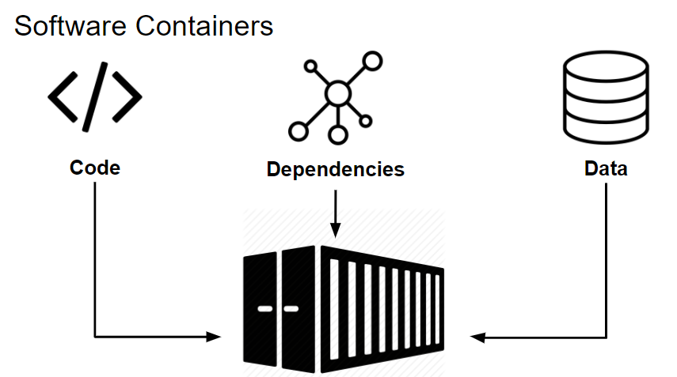
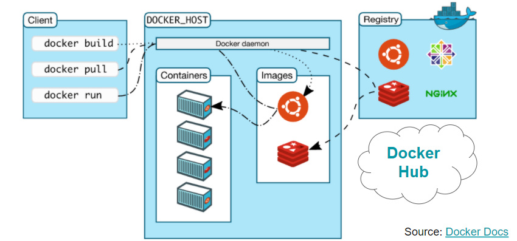

# Docker and application architecture


Based on PyCon Lecture https://docs.google.com/presentation/d/11y8C-5u35_7--IUPuI4i4Xqiy-FUcR1GAERdJg692c8/edit?usp=sharing

## Microservices

* Do one thing and do it well.


### Desired properties

Microservice software should be:
* Modular
    * Isolated
    * Platform-independent
    * Extendable
    * Easily distributable
    * Communicating with other microservices
* Scalable
* Persistent
* Secure
* Communicating with outside world


## Basic concepts of Docker
* environment for self-contained piece of software
* Linux-based, but runnable (almost) anywhere 
* Can be easily extended
* Hosted on computer, yet isolated
* Networking
* Ensure reproducibility
* Allow scalability
* Ease deployment
* Improve security
* Manage communication
* allows to `package` and `run`



### Docker image
* A frozen snapshot of a container
* set of immutable files creating software together
* Defined by `Dockerfile` 
* Structured in `layers`


### Docker container
* Runtime instance of `image`
* Virtual computer within `host` running some code
* Access network using `ports`
* Access files on host using `volumes`
* launched using `docker run [image]`


### Overview of architecture


* Client manages Python containers
* Registry is a repository of images
* Host hosts containers


### Dockerfile
* File containing all commands used to assemble image
* Automated build

### Dockerfile commands
See in detail: https://docs.docker.com/engine/reference/builder/

**FROM**: Base image for a dockerfile

**COPY**: Copy file from host to container

**ENV**: Sets Environmental variables

**RUN**: Executes shell commands within a container

**EXPOSE**: Expose port for other containers


### Example Dockerfile
```Dockerfile

# Use Python runtime as base image
FROM python:3.6.3-alpine3.6

# Set the working directory to /app and copy current dir
WORKDIR /app
COPY . /app

# Run hello_world.py when the container launches
CMD ["python", "-c","print('Hello World!')"]

```

### Build it:

* Build = Execute steps defined in the container and freeze it into the image

> docker build -t hello-world

* builds `Dockerfile` in this directory into the Docker image tagged as `hello-world`

### Run

* Run = launch and launch app inside

> docker run hello-world 

* create container 
prints `Hello World!`


### Stop container

> docker stop hello-world

### See list of running containers

> docker ps

### See list of all containers on host:

> docker ps --all

## Volumes

* shared disk space between `host` and `container`
* Changes are on the fly

> docker run -v /full/host/path:/container/path


## Ports

> docker run -p 9999:8888 

`host_port`:`container_port`

### Real-world example:

> docker run jupyter/scipy-notebook -p 80:8888 -v ./jupyter-data:/work


1. Check if there is an image tagged as `jupyter/scipy-notebook` or pulls it from DockerHub if it does not exist

2. Jupyter Applications  by default communicates via port 8888. 
The -p 80:8888 tells Docker to redirect:

    * communication coming to `host` on port `80` (standard HTTP port) to container's port `8888`.

    * Communication going out from `container`'s port `8888` is further sent away via `80`

3. Postgres stores its internal data within the `/var/lib/postgresql/data` folder
    * Any file change happening within `/var/lib/postgresql/data` is visible on host `./db-data/`
    * File changes on `./db-data/` would immidiately reflected in `var/lib/postgresql/data`


### Let's go modular - introduction to `docker-compose`

This runs jupyter stack in a shared environment with postgres database

```yml
version: 3

services:
    db:
        image: postgres:13
        ports:
            - "5432:5432"
    jupyter:
        image: jupyter/scipy-notebook
        ports:
            - "8888:8888"
        volumes:
            - "./jupyter-data:/work/
        
```


### Question:

*What if I wanted to add an additional package into `jupyter/scipy-notebook`?*


## AIRFLOW plus SUPERSET DOCKER-COMPOSE STACK
 
Task:

    1. Regularly collect `sreality.cz` data from the internet
    2. Store collected data on cloud storage (in raw JSON format)
    3. Visualize in the dashboard


**Solution**

### Apache Airflow Scheduler

    - regularly runs python job that collecting JSONs from sreality API and stores it in S3 cloud storage

    - when downloading session finishes, it collects data from the last JSON file and import it into Postgres database


### Superset 
    
    Interactive visualization based on data in the database

    Own SQL query builder to explore the data in detail\

