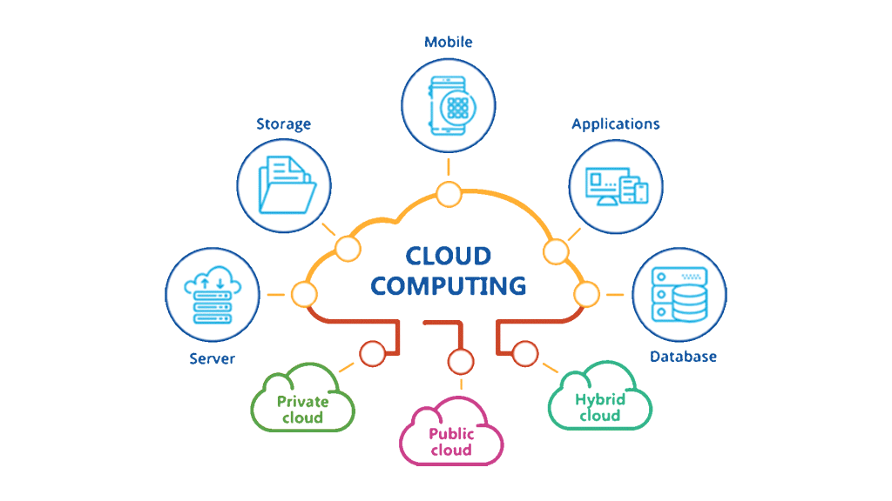

# Lecture 11 - cloud computing

Today we will learn, how to run a simple service in the cloud through Lamba functions. Sounds cool?

## Motivation
- create a web service, something like a jupyter notebook with some code
- it is always there

- Let's create a service which optimizes a portfolio for us!

### What is cloud?



- bunch of **buzzwords**
- Tomas Sedlacek on cloud `Naše těla jsou pochopitelně na tomto světě, ale naše duše se pomalu stěhuje do cloudu, do oblak, do jakéhosi všeobecného nebe, kde vše existuje virtuálně a nic reálně. Internet je lehkovážný. A bude víc.`
- in reality, it is quite physical


```
So cloud is a huge collection of computers.
You can rent it and use it.
You can store data, transfer data, calculate things, run databases, websites or use great machine learning tools.
```
- Why does it matter? How can **Netflix** stream House of Cards to half of the planet at the same time? How can **kiwi.com** run queries on hundreds thousands of routes at the same time?
- **Economics of scale**
- Not just within the service itself, but for customers
- Pay as you use, so you can obtain cheaply any size of computational power. Dont need it anymore? Just shut it down.
- No need to buy a PC at 30k CZK, provide a static IP, or tunneling to it, then when you finished your studies, what do you do with it?


### What is a Lambda function?

- a simple piece of code: a function, which is triggered by some event
- the concept is language agnostic, hence you can use variety of languags (python, C, go, java, node, ....)
- similar across cloud providers - AWS, Azure, GCP etc
- you do not need to install and **maintain infrastructure**
- basis of **microservice architecture**

So we have a concept that is:
- scalable
- cost efficient (you do not provision server for which you pay 24/7, and Linux guy who maintains it). Only pay per execution! $0.20 per 1M executions. Good deal?
- easy to deploy with [serverless](https://www.serverless.com/) which works with AWS, GCP
- lets start developing!

## Part1 Let's create a hello world web service!

- In part1-helloworld I can run a simple service that will respond to me.
    - Do you remember lecture on API?
- I will explain the **basic concepts** and demonstrate a simple setup which creates some resources in the cloud

- It was created with and cleaned to make it clear `serverless create --template aws-python3`
- Deploy (create resources on AWS) `serverless deploy`
- trigger by sending POST request to `https://xxxxxxxx.execute-api.us-east-1.amazonaws.com/dev/hello`

- the function lives here: `https://console.aws.amazon.com/lambda/home?region=us-east-1#/functions/part1-helloworld-dev-hello?tab=code`

# Mini project: create service which calculates portfolio optimization for some tickers

- create locally a function which takes list of tickers and produces weights of Minimal Global Variance Portfolio
- download YTD data based on the tickers
- calculate covariance and weights
- return a dictionary ticker:weight

- deploy as a HTTP service on AWS cloud


## Part 2: prepare environment

- run again `serverless create --template aws-python3`

- you can add dependencies to Lambda, but not much within a single layer actually
- we can just about fit in `pandas`
- install the plugin which packages deps `sls plugin install -n serverless-python-requirements`
    - we can install more plugins like to set the domain etc.
    - but now we just make it simple

- how to calculate global minimal variance portfolio
    - [maths explained here](https://bookdown.org/compfinezbook/introcompfinr/Determining-the-Global.html)
## Part 3:

- set up cron job to do it, notify user?

## Part 4:

- set up domain
